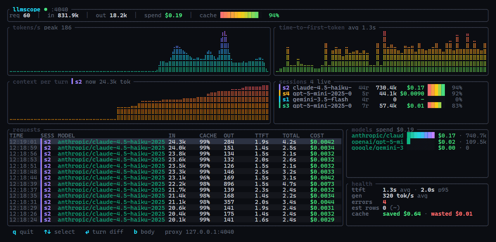
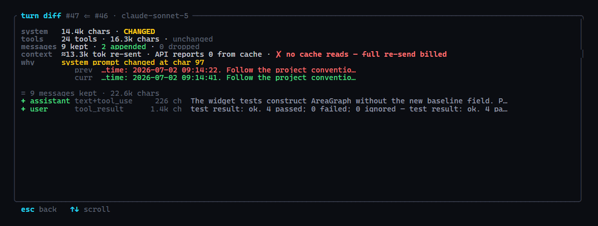

# llmscope

**Wireshark for LLM traffic.** A zero-config local proxy that shows you what your agents *actually* send — every request, token, cache hit and dollar — live, in a `top`-style TUI.

No SDK. No account. No config. One binary. **~0.1 ms of added latency.**



```
llmscope run -- claude        # terminal 1: your agent, unchanged
llmscope top                  # terminal 2: watch everything it does
```

## Why

Coding agents burn tokens invisibly. A single agent turn can re-send a
100k-token context; a cache misconfiguration can silently multiply your bill
by 10x; a "quick" session can fan out into side agents you never see.
llmscope sits between your agent and the API and makes all of it visible —
locally, with nothing leaving your machine.

## How it works

`llmscope run -- <cmd>` starts a local proxy and launches your command with
`ANTHROPIC_BASE_URL` / `OPENAI_BASE_URL` pointed at it. Claude Code, Codex,
Gemini CLI, opencode, and every major SDK respect those variables, so there
is nothing to instrument. Responses stream through untouched — llmscope tees
the bytes, parses the SSE stream on the side, and records:

- **tokens** — input / output / cache reads / cache writes, per request
- **cost** — priced per model with per-model cache read/write rates, from a
  built-in table generated off [LiteLLM's community pricing data](https://github.com/BerriAI/litellm/blob/main/model_prices_and_context_window.json)
  (`python scripts/update_prices.py` refreshes it); when a gateway reports
  the exact cost — OpenRouter sends `usage.cost` on every response — that
  number wins over the table
- **latency** — time-to-first-token vs. total generation time
- **sessions** — conversations are fingerprinted, so parallel agents and
  side calls (title generators, summarizers) are tracked separately
- **full bodies** — every request and response, in a local SQLite file

## The turn diff

Select any request and hit `⏎` to see what your agent *changed* since its
previous turn: system prompt and tools changed/unchanged, messages
kept/appended/dropped (a broken prefix exposes history rewrites like
compaction), and the economics line — the re-sent context estimate versus
the cache reads the API actually reported:



`✗ no cache reads — full re-send billed` on a 100k-token turn is the most
expensive line of output you'll ever be glad to see. And when a turn does
miss, the `why` line names the culprit instead of leaving you to guess:

- the exact character where the system prompt diverged (timestamps
  re-rendered into the prompt every turn are the classic cache-buster)
- which tool definition changed, appeared, or vanished
- the message where history was rewritten (compaction, summarization)
- missing `cache_control` breakpoints — explicit caching never enabled
- an idle gap longer than the cache TTL

## The dashboard

- **tokens/s** and **TTFT** as braille area graphs with live gradients
- **context per turn** — watch the selected conversation's context balloon
- **sessions** — one row per conversation: requests, tokens, spend, cache meter
- **models** — spend meters per model
- **health** — avg/p95 TTFT, generation speed, errors, and cache economics:
  dollars *saved* by caching and dollars *wasted* on cold re-sends
- `⏎` turn diff · `b` raw request/response bodies · `↑↓` select

Panels fold away gracefully on small terminals.

## Works with anything that speaks the protocols

```
# Claude Code
llmscope run -- claude

# opencode via OpenRouter (set the provider baseURL to the proxy)
llmscope serve --openai-upstream https://openrouter.ai/api

# Local models: Ollama, vLLM, llama.cpp
llmscope run --openai-upstream http://127.0.0.1:11434 -- python my_agent.py
```

## Overhead

Streaming passthrough with the capture tee off the hot path. Measured with
`scripts/bench_overhead.py` (300 samples, local mock upstream, reused
connection):

```
direct   p50 0.21 ms   p95 0.29 ms
proxied  p50 0.30 ms   p95 0.38 ms
overhead p50 0.09 ms   p95 0.09 ms
```

## Privacy

Everything stays on your machine. Captures go to a local SQLite file
(`llmscope run --db <path>` to relocate). Authorization headers and API keys
are never stored — only request/response bodies and timing metadata.

## Install

```
# prebuilt binary — macOS / Linux
curl -LsSf https://github.com/Mapika/llmscope/releases/latest/download/llmscope-installer.sh | sh

# prebuilt binary — Windows
powershell -ExecutionPolicy Bypass -c "irm https://github.com/Mapika/llmscope/releases/latest/download/llmscope-installer.ps1 | iex"

# via cargo
cargo install llmscope
```

Requires a terminal with truecolor + braille support (Windows Terminal,
iTerm2, kitty, most modern terminals).

## Roadmap

- [ ] pricing overrides via config file (built-ins regenerate from LiteLLM's table)
- [ ] web UI for deep inspection and prompt diffing
- [ ] OTLP export
- [ ] request replay

## License

MIT
